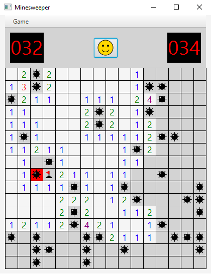

# Minesweeper

A fully featured Minesweeper clone built with **Java** and **JavaFX**.



## Installation

Download the installer from the [Releases](https://github.com/DannyNagelMath/Minesweeper/releases) page, run it on Windows, and a desktop shortcut is created automatically. No JDK or JavaFX installation required.

## Features

- Three preset difficulty levels: **Beginner** (10×10, 10 mines), **Intermediate** (16×16, 40 mines), and **Expert** (16×30, 99 mines)
- **Custom game mode** — configure any grid size and mine count via an in-app dialog
- Live mine counter and elapsed-time display with classic 7-segment styling
- Smiley-face reset button; sunglasses face on win
- Left-click to reveal, right-click to flag

## Tech Stack

| | |
|---|---|
| Language | Java 17 |
| UI Framework | JavaFX |
| Build & Packaging | Maven · jpackage · launch4j |

## Build from Source

```bash
git clone https://github.com/DannyNagelMath/Minesweeper.git
```

Open the project in IntelliJ (or your preferred IDE) and run the `Runner` class. Requires Java 17+ and JavaFX 17+ on your PATH.

## Project Structure

```
Minesweeper/
├── Runner        # Application entry point; manages scenes and difficulty menu
├── GameBoard     # Grid logic — mine placement, reveal, flood-fill
├── Tile          # Individual cell state and rendering
└── Icon          # Custom-drawn face/icon graphics
```
